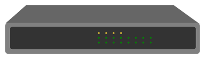

# Trabajo hardware sobre switches

## Indice

1.- Introducción.

   - [¿Que son los switches?](/Documentos/introducion.md)

2.- Marcas y modelos

  - [Marcas de switches](/Documentos/marcas.md)

3.- Tipos

   - [Tipos y caracteristicas](/Documentos/caracteristicas.md)

4.- Caso práctico

   - [Caso práctico](/Documentos/practico.md)

5.- [Conclusion](/Documentos/conclusion.md) 
## Referencia

- Con ayuda de: `ChatGPT` 
- Gracias a [``]()

## Autores

- `Andrés Del Pino Muñoz` (https://github.com/0Vinylo0)
- `Manuel Martín Galve` (https://github.com/mmargal28)
- `Deneb Donoso Duran` (https://github.com/Xicobot)

## Licencia

<a property="dct:title" rel="cc:attributionURL" href="https://github.com/mmargal28/Trabajo-hardware-sobre-switches">Trabajo sobre switches </a> by  Manuel Martín Galve, Andrés del Pino Muñoz, Deneb Donoso Duran is licensed under <a href="http://creativecommons.org/licenses/by-nc-nd/4.0/?ref=chooser-v1" target="_blank" rel="license noopener noreferrer" style="display:inline-block;">CC BY-NC-ND 4.0</a>

 Binary file addedBIN +18 KB 
img/grafica.png
